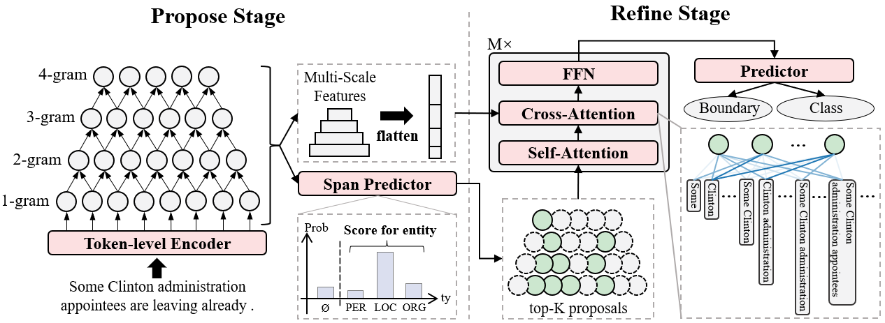

# Propose-and-Refine: A Two-Stage Set Prediction Network for Nested Named Entity Recognition

## Overview



## Usage

### Environment setup and preparation

```bash
conda create --name pnr --file requirements.txt
```

* Place dataset under folder `data`
* Download pre-trained word embedding and set `wordvec_path` in the configuration file to the path of word embedding file.
* Download pre-trained language model (from huggingface) and set `model_path` and `tokenizer_path` in the configuration file to the path of the pre-trained language model.

#### Datasets

+ ACE04: https://catalog.ldc.upenn.edu/LDC2005T09
+ ACE05: https://catalog.ldc.upenn.edu/LDC2006T06
+ KBP17: https://catalog.ldc.upenn.edu/LDC2017D55
+ GENIA: http://www.geniaproject.org/genia-corpus
+ CoNLL03: https://data.deepai.org/conll2003.zip


Data format:
```json
{
    "tokens": ["Others", ",", "though", ",", "are", "novices", "."],
    "entities": [{"type": "PER", "start": 0, "end": 1}, {"type": "PER", "start": 5, "end": 6}], "relations": [], "org_id": "CNN_IP_20030328.1600.07",
    "ltokens": ["WOODRUFF", "We", "know", "that", "some", "of", "the", "American", "troops", "now", "fighting", "in", "Iraq", "are", "longtime", "veterans", "of", "warfare", ",", "probably", "not", "most", ",", "but", "some", ".", "Their", "military", "service", "goes", "back", "to", "the", "Vietnam", "era", "."],
    "rtokens": ["So", "what", "is", "it", "like", "for", "them", "to", "face", "combat", "far", "from", "home", "?", "For", "an", "idea", ",", "here", "is", "CNN", "'s", "Candy", "Crowley", "with", "some", "war", "stories", "."]
}
```

### Train

```bash
python main.py train --config cfg/ace05/train.conf
```

### Evaluate

Set `model_path` and `tokenzier_path` to the checkpoint dir before running.

```bash
python main.py eval --config cfg/ace05/eval.conf
```

## Evaluation

We perform evaluation on RTX-3090

TODO

## Appendix

Please refer to [Appendix](appendix.md)

## Citation

TODO